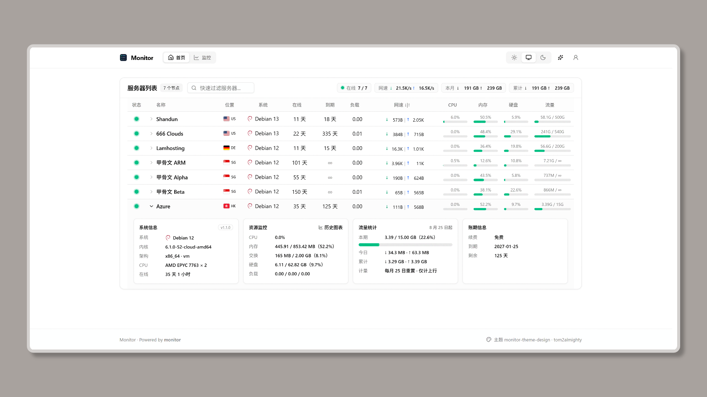

# monitor-theme-design

[monitor](https://github.com/monitor-probe/monitor) 的公开页主题。

Fork 自 [stqfdyr/monitor-theme-serverstatus](https://github.com/monitor-probe/monitor-theme-serverstatus)，结合 tweakcn(ShadcnUI) Tokens 与 Zen Browser 风格的噪点磨砂效果。



## 特性

- **配色切换**：均含亮色/暗色模式。
- **噪点与磨砂效果**：两个参数各支持 0%~100% 无级调节。

## 安装

### 方法一：后台上传压缩包

1. 在 [Releases](https://github.com/tom2almighty/monitor-theme-design/releases) 页面下载最新的 `theme.tar.gz`。
2. 登录 monitor hub 后台，进入「主题」管理页面。
3. 上传 `theme.tar.gz` 完成安装。卡片上的 ⟳ 按钮可检查本仓库是否有新版本。

### 方法二：解压至目录

将 release 产物解压到 hub 所在主机 `--themes` 目录下的 `monitor-theme-design/` 文件夹：

```bash
mkdir -p /path/to/monitor/themes/monitor-theme-design
tar -xzf theme.tar.gz -C /path/to/monitor/themes/monitor-theme-design
```

然后在后台「主题」页刷新并选中切换。

## 协议与致谢

- 本项目基于 [MIT License](LICENSE) 开源。
- 感谢 [monitor-probe/monitor](https://github.com/monitor-probe/monitor)。
- 感谢 [stqfdyr](https://github.com/stqfdyr) 的原版 [monitor-theme-serverstatus](https://github.com/monitor-probe/monitor-theme-serverstatus) 主题。
- 国旗图标来自 [flag-icons](https://github.com/lipis/flag-icons)，MIT 协议。